# Oracle Functions + Oracle REST Data Services (ORDS) on Oracle Autonomous Database

Fn functions interact with the REST endpoints defined within a RESTful service in ORDS

- driver agnostic - no dependency on JDBC etc.
- language agnostic - this example is Java based, but you can use HTTP client in any language (which Fn supports)
- `Serverless` approach !

## Overview

Oracle Autonomous Database offers different types of deployments and workloads which you can leverage depending on your requirements and use cases. For this sample, we will use

- **Autonomous Transaction Processing (ATP) workload** - configures the database for a transactional workload, with a bias towards high volumes of random data access.
- **Serverless  deployment** - you provision and manage only the Autonomous Transaction Processing database, while Oracle handles the infrastructure deployment and management tasks.

> For details, please refer to [the documentation](https://docs.cloud.oracle.com/iaas/Content/Database/Concepts/adboverview.htm)

## Create an Oracle Autonomous Database instance

Use the OCI CLI to quickly setup a Serverless Oracle ATP instance.

> Please refer to [the documentation](https://docs.cloud.oracle.com/iaas/Content/API/Concepts/cliconcepts.htm) for instructions on how to setup the CLI.

We will use the [`db autonomous-database create`](https://docs.cloud.oracle.com/iaas/tools/oci-cli/latest/oci_cli_docs/cmdref/db.html) command to spin up the database instance.

	oci --profile <OCI_CONFIG_PROFILE> db autonomous-database create --compartment-id <COMPARTMENT_OCID> --db-name <DATABASE_NAME> --cpu-core-count <CPU_CORES> --data-storage-size-in-tbs <DB_STORAGE> --admin-password <DB_ADMIN_PASSWORD> --db-workload <WORKLOAD_TYPE> --license-model <LICSENSE_TYPE> --is-dedicated <IS_DEDICATED>

e.g. 

	oci --profile foorbar-config db autonomous-database create --compartment-id ocid1.compartment.oc1..aaaaaaaaokbzj2jn3hf5kwdwqoxl2dq7u42p3tsmxrjd7s3uu7x23tfoobar --db-name testatpdb --cpu-core-count 1 --data-storage-size-in-tbs 1 --admin-password T0ps3cr3t --db-workload OLTP --license-model LICENSE_INCLUDED --is-dedicated false

## Configure Oracle APEX

Each Autonomous Transaction Processing instance includes a dedicated instance of Oracle Application Express which you can use this instance to create multiple workspaces.

Once you sign in to your Oracle Cloud Account, from the *Oracle Cloud Infrastructure* left navigation list click *Autonomous Transaction Processing*. On the *Autonomous Databases* page select an *Autonomous Transaction Processing* instance from the links under the *Name* column. On the instance details page, navigage to *Service Console > Administration*. In the *REST Data Services* section click *APEX*.

> Documentation [available here](https://docs.oracle.com/en/cloud/paas/atp-cloud/atpug/application-express-autonomous-database.html#GUID-D078638E-4F59-46CA-A14D-DAEBE1514BE8)

You can now login to Application Express. 

- In the Workspace field, enter `INTERNAL`.
- In the Username field, enter `ADMIN`.
- In the Password field, enter the password for the Autonomous Transaction Processing `ADMIN` user.

An Autonomous Transaction Processing instance does not have any precreated workspaces for Oracle Application Express. [Create a workspace](https://docs.oracle.com/en/cloud/paas/atp-cloud/atpug/application-express-autonomous-database.html#GUID-9BD5E93B-4624-4A29-9D90-7AF31BC12707) if you have not already done so or use these instructions to create additional workspaces.

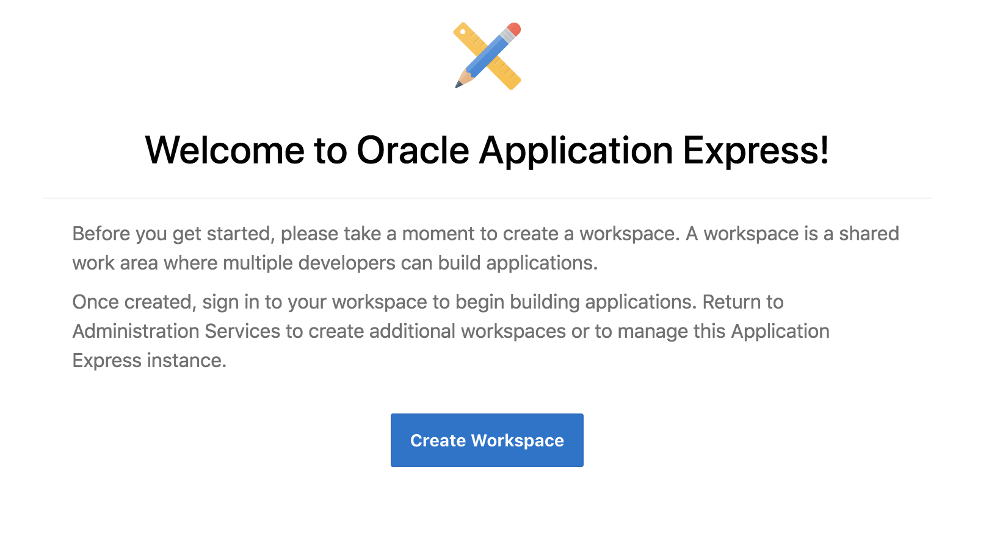

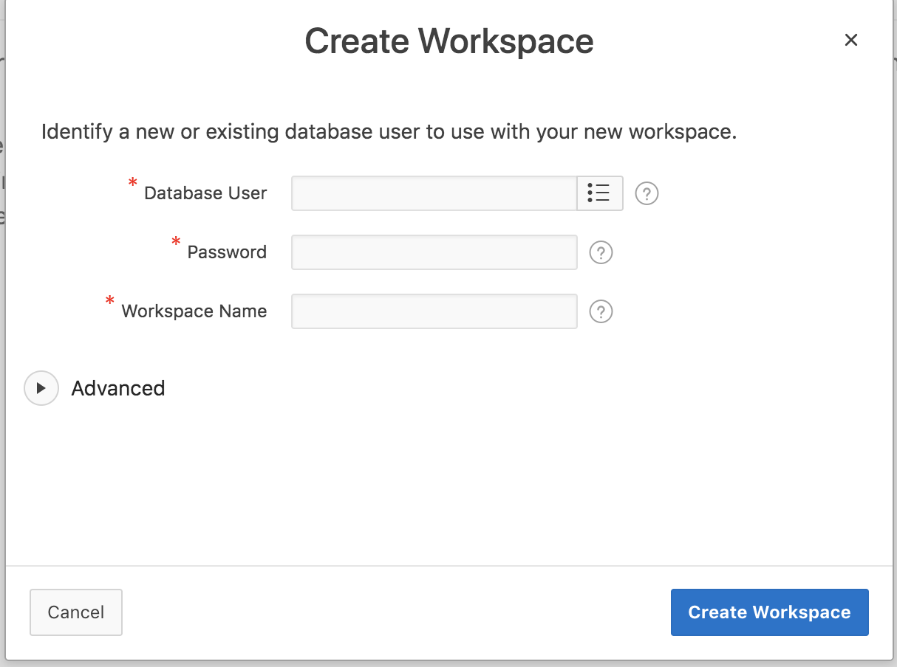

## Develop RESTful Services in Autonomous Database 

You can develop and deploy RESTful Services with native Oracle REST Data Services (ORDS) support on an Autonomous Transaction Processing database. Access RESTful Services from the Workspace home page by clicking SQL Workshop and then RESTful Services - on the Workspace home page, navigate to *SQL Workshop > RESTful Services*.

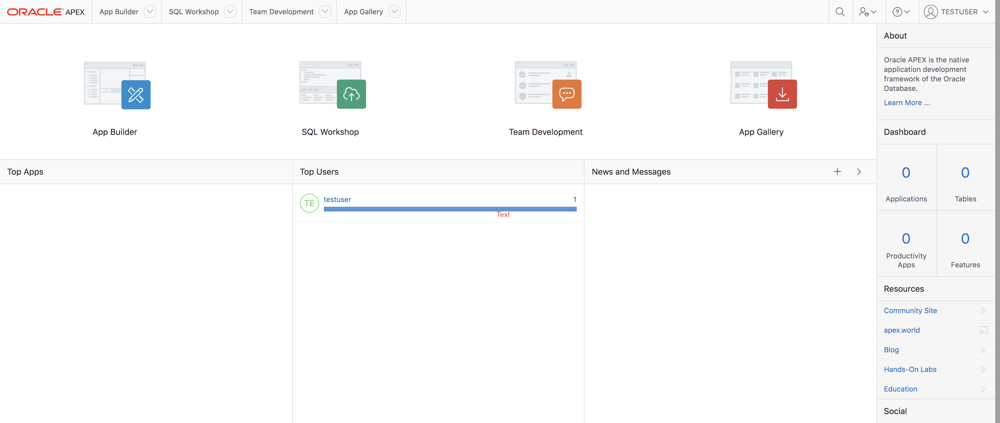

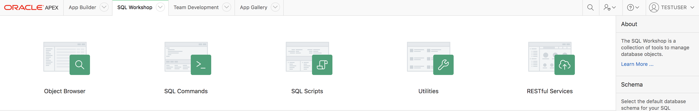

If you are accessing ORDS Restful Services in a new workspace, you must register the schema with ORDS RESTful Data Services - click *Register Schema with ORDS*

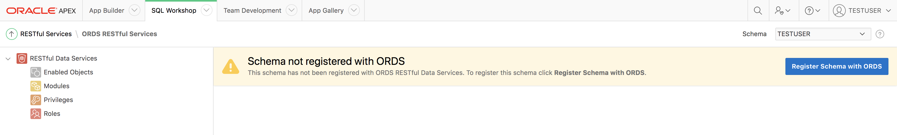

ORDS Schema Attributes dialog appears - enter the attribute details and click *Save Schema Attributes*.

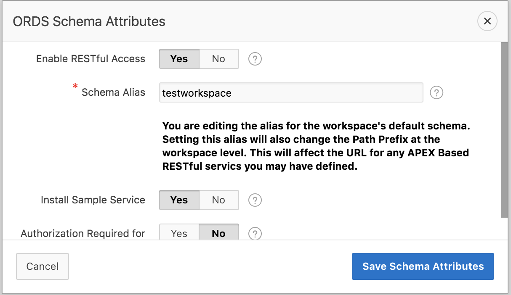

Upon registering the schema with ORDS, the ORDS RESTful services page appears displaying the ORDS version.

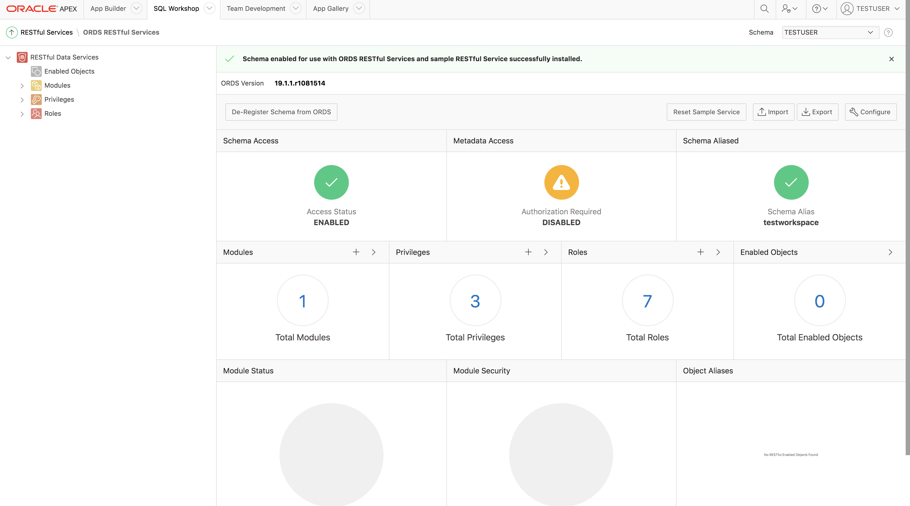

Oracle APEX provides a pre-installed sample service `oracle.example.hr`- we will integrate Oracle Function with this module. This module provides example resource templates and resource handlers that implement several different methods to retrieve and display employee information from the `EMP` table. It consists of several resource templates each of which demonstrates a different way of retrieving information and formatting the returned results.

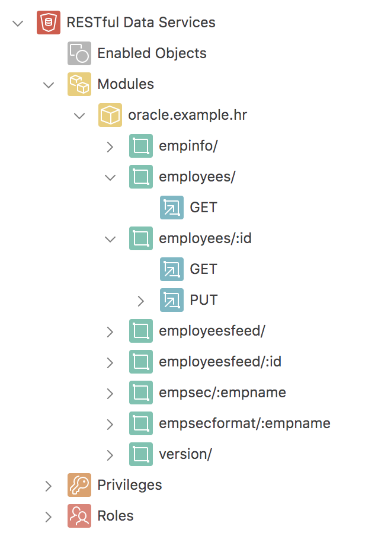

We will make use of the following:

- `employees/` - Employee information from the `EMP` table is displayed in JSON format.

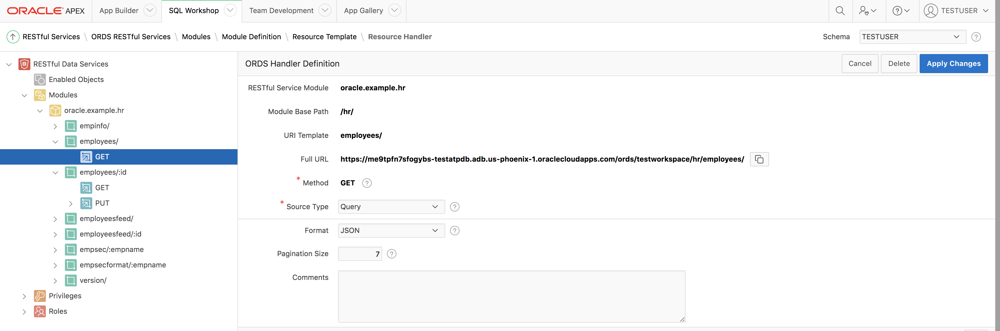

- `employees/:id` - Employee information from the `EMP` table for a specified `id` is returned. The employee information for a specified id is updated in case the `PUT` resource handler is invoked.

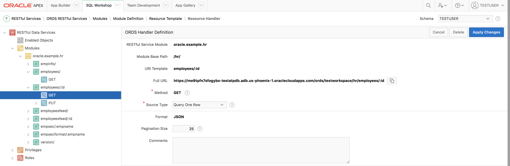

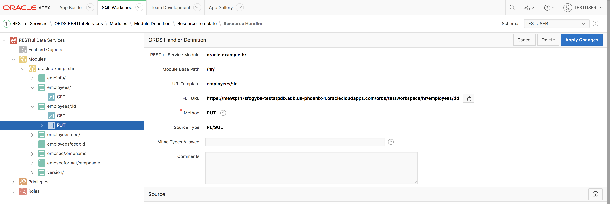

### Note on `Full URL`

The `Full URL` attribute (in the above screenshots) represents the REST endpoint for the specific handler. It consists of the ATP instance specific part followed by the workspace name along with other path parameters 

e.g. In the URL for fetching all employees info `https://me9tpfn7sfogybs-testatpdb.adb.us-phoenix-1.oraclecloudapps.com/ords/testworkspace/hr/employees/`

- `megtpfn7sfogybs-testatpdb.adb.us-phoenix-1.oraclecloudapps.com` - instance specific part
- `testworkspace` - name of the APEX workspace
- `hr/employees/` - remaining path parameter

## Oracle Functions

### Pre-requisites

Before you begin, please ensure that you have configure the Oracle Functions development environment. 

**Fn CLI**

Download (or update) the [Fn CLI](https://github.com/fnproject/cli)

`curl -LSs https://raw.githubusercontent.com/fnproject/cli/master/install | sh`

**Switch to correct context**

- `fn use context <your context name>`
- Check using `fn ls apps`

### Deploy to Oracle Functions

Clone the Git repo and change to the correct directory

	git clone https://github.com/abhirockzz/fn-atp-ords-sample
	cd fn-atp-ords-sample

Replace `ORDS_REST_SERVICE_ENDPOINT` environment variable in the `config` section of `app.yaml` - this is the value of the `Full URL` attribute before the name of the workspace e.g. `https://megtpfn7sfogybs-testatpdb.adb.us-phoenix-1.oraclecloudapps.com/ords/testworkspace/hr/` 

Create an application using the console or CLI.

	fn create app fn-atp-ords --annotation oracle.com/oci/subnetIds='SUBNET_OCIDs

e.g.

    fn create app fn-atp-ords --annotation oracle.com/oci/subnetIds='["ocid1.subnet.oc1.phx.aaaaaaaaghmsma7mpqhqdhbgnby25u2zo4wqlrrcskvu7jg56dryxtfoobar"]' 

Deploy the application - this will deploy both the functions

	fn -v deploy --all

All your functions should now be deployed. Check them using 

	fn inspect app fn-atp-ords

## Test

### Get all employees

	fn invoke fn-atp-ords read-emps

You'll get back a JSON response (trimmed for brevity)

	{
	"items": [
		{
		"uri": {
			"$ref": "https://megtpfn7sfogybs-testatpdb.adb.us-phoenix-1.oraclecloudapps.com/ords/testworkspace/hr/employees/7369"
		},
		"rn": 1,
		"empno": 7369,
		"ename": "SMITH",
		"job": "CLERK",
		"hiredate": "1980-12-17T00:00:00Z",
		"mgr": 7902,
		"sal": 800,
		"comm": null,
		"deptno": 20
		},
		{
		"uri": {
			"$ref": "https://megtpfn7sfogybs-testatpdb.adb.us-phoenix-1.oraclecloudapps.com/ords/testworkspace/hr/employees/7499"
		},
		"rn": 2,
		"empno": 7499,
		"ename": "ALLEN",
		"job": "SALESMAN",
		"hiredate": "1981-02-20T00:00:00Z",
		"mgr": 7698,
		"sal": 1600,
		"comm": 300,
		"deptno": 30
		}
	.......
	}

### Get employee by ID

	echo -n '7654' | fn invoke fn-atp-ords read-emps

You should get the following result

	{
		"empno": 7654,
		"ename": "MARTIN",
		"job": "SALESMAN",
		"mgr": 7698,
		"hiredate": "1981-09-28T00:00:00Z",
		"sal": 1250,
		"comm": 1400,
		"deptno": 30
	}

### Update

Let's update the record for Employee `7654`.

	echo -n '{"empno":7654,"ename":"MARTIN","job":"SALESMAN","mgr":7698,"hiredate":"1981-09-28T00:00:00Z","sal":1500,"comm":1400,"deptno":30}' | fn invoke fn-atp-ords update-emps

You should get a `SUCCESS` as the response. You should see the updated info if you search for the employee 
info again

	echo -n '7654' | fn invoke fn-atp-ords read-emps

You should get back a JSON response (with the updated salary)

	{
	    "empno": 7654,
	    "ename": "MARTIN",
	    "job": "SALESMAN",
	    "mgr": 7698,
	    "hiredate": "1981-09-28T00:00:00Z",
	    "sal": 1500,
	    "comm": 1400,
	    "deptno": 30
	}